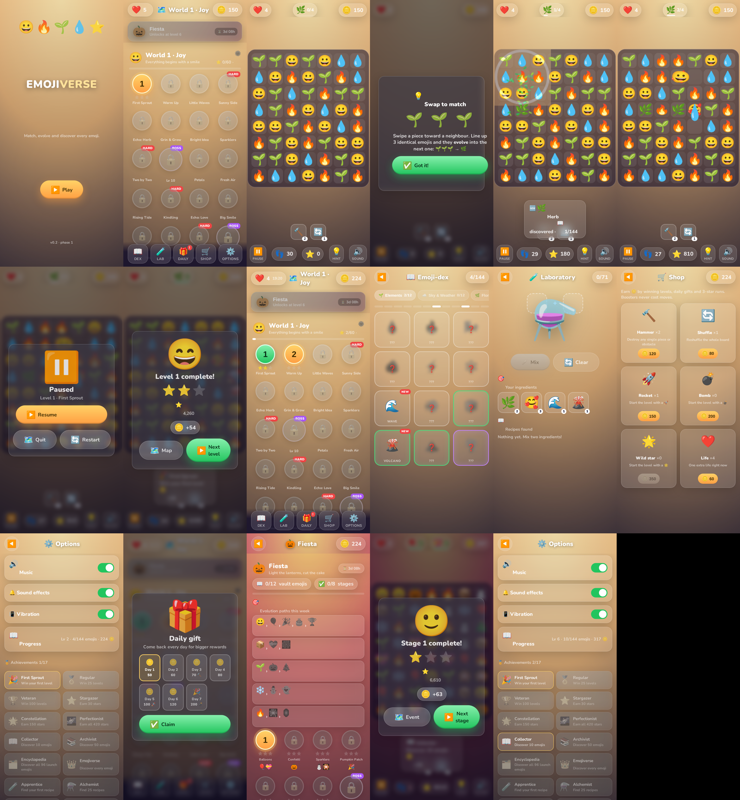

# 🌱 EMOJIVERSE

> *Match, evolve and discover every emoji.*
> A mobile match‑3 × alchemy game built **exclusively** from Google Noto Color Emoji — pieces, UI, currency, everything.



*Splash · Saga map · Level sheet · Tutorial · Board · Pause · Win · Emoji‑dex · Laboratory · Shop · Options · Daily gift — every screenshot above is produced by the E2E run.*

| | |
|---|---|
| **Engine** | TypeScript 5 · Phaser 3.90 (WebGL) · HTML/CSS HUD · Vite · Capacitor 6 |
| **Rules engine** | Pure, deterministic, renderer‑agnostic (`packages/core`) — 42 Vitest specs |
| **Content** | 144 curated emojis · 12 families · 20 evolution chains · 71 cross recipes · **7 worlds × 20 = 140 levels** · **4 weekly vault events × 8 stages** (all auto‑tuned) |
| **Native** | Capacitor 6 Android project committed (adaptive icon, splash, portrait, back button, status bar); iOS via `cap add ios` |
| **Audio** | 100 % procedural: SFX engine (pentatonic combo ladder) + per‑world adaptive music with ducking — zero audio files |
| **Build size** | 78 KB game code + 1.2 MB Phaser (vendored, cacheable) + 0.9 MB emoji atlas |

## 🎮 Play it

```bash
npm ci
npm run build        # builds Noto atlas + validates content + bundles PWA (<1 s, <500 MB RAM)
npm run serve:dist   # http://localhost:4173  (?level=N to jump straight into a level, &sheet=1 to show its sheet)
```

Dev server with HMR: `npm run dev` → http://localhost:5173

## 🧠 Core loop

```
   ┌──────────── BOARD (turn‑limited, Candy Crush verb) ────────────┐
   │  swap → 3 identical → EVOLVE to next tier (🌱🌱🌱 → 🌿)          │
   │  4 in line → 🚀 rocket   L/T/cross → 💣 bomb   5 in line → 🌟   │
   │  💣+🚀 = MEGA CROSS · 💣+💣 = 5×5 · 🚀+🚀 = cross · 🌟+X = all X  │
   └───────────────────────────┬─────────────────────────────────────┘
                               │ collected pieces
   ┌──────────── LABORATORY 🧪 (no turn pressure, Little Alchemy verb) ┐
   │  drag A + B into ⚗️ → recipe? → DISCOVER (😢+😡 = 🥺)             │
   │  no recipe → 🌫️ + an Echo hint. Never punishes.                  │
   └───────────────────────────┬─────────────────────────────────────┘
                               │ new pieces unlock on future boards
   ┌──────────── EMOJI‑DEX 📖 ── 144 slots · silhouettes · rarity · echoes ┐
```

Full design rationale: [docs/GDD.md](docs/GDD.md) · Architecture: [docs/TDD.md](docs/TDD.md) · Decisions: [docs/adr/](docs/adr/)

## 🖥️ Screens & flow (genre‑standard, Royal Match / Candy Crush research applied)

```
Splash ──▶ Saga Map (7 worlds × 20 nodes, stars, HARD/BOSS tags, lives timer, daily badge)
             │  tap node
             ▼
         Level sheet (goals · moves · difficulty · pick pre‑boosters 🚀💣🌟) ──▶ ❤️ −1
             │
             ▼
         Tutorial card (one mechanic per card, once) ──▶ BOARD
             │        HUD: lives · goals w/ progress bars · coins | pause · moves · score · hint · sound
             │        Side bar: 🔨 hammer (tap piece) · 🔄 shuffle — never cost a move
             ▼
         Win (stars, coins, streak bonus, new emojis → Next level)  /  Lose (near‑miss → “+5 moves” offer, retry, map)
Map ⇄ 📖 Emoji‑dex (silhouettes, rarity, echoes, event hints) · 🧪 Laboratory (mix A+B) · 🛒 Shop · ⚙️ Options (achievements, install) · 🎁 Daily gift (7‑day streak)
Map ⇄ 🎭 **Vault event** (weekly rotation: Masquerade · Fiesta · Legends · Secrets — 8 stages, milestone ladder, 48 vault emojis)
```

Mechanic schedule: W1 swap→rocket→bomb · W2 rocks · W3 ice + odd boards · W4 dust · W5 cages · W6 wild star · W7 synergies. Difficulty rhythm easy/easy/normal/hard/breather, mid‑boss at 10, boss at 20, first three levels near‑unlosable, mercy spawn bias after 3 losses.

## 📦 Monorepo

```
packages/
  core/      rules engine (Board, match detection, specials, synergies, cascades, LevelRunner, GreedyBot)
  content/   emojis.ts (144), chains.ts, recipes.ts, levels.ts + validate.ts (CI gate)
  content/   … levels.ts (140‑level generator) · events.ts (4 vault events × 8 stages) · tuning.ts (auto‑tuned budgets) · validate.ts (CI gate)
  game/      Phaser BoardScene v2 (swipe + tap input, tap‑to‑fire specials, hammer, dust/cages/holes), vfx.ts, audio.ts, music.ts, haptics.ts
  ui/        tokens.css (100 %-emoji design system, screens, sheets, modals) + hud.ts
  app/       main.ts (router + level flow) · state.ts (economy & save v2) · native.ts (Capacitor shell) · achievements.ts
             screens/{splash,map,event,game,popups,dex,lab,shop,settings}.ts · android/ (committed Capacitor project)
tools/
  build-atlas.ts   Noto PNG → texture atlas @1x/@2x + JSON + CSS sprites
  simulate.ts      balance simulator (bot win‑rate per level, per‑world averages)
  tune.ts          auto‑tuner: adjusts each level's moves until the bot lands in its difficulty band
  e2e/smoke.py     Playwright full‑flow test (every screen, real drag input, 15 screenshots)
```

## ✅ Quality gates

| Command | Gate |
|---|---|
| `npm run lint` · `npm run typecheck` | ESLint + `tsc --strict --noUncheckedIndexedAccess` |
| `npm test` | 47 specs: shapes, specials, **all synergies**, blockers, dust, cages, holes, boosters, tap‑to‑fire, +moves, cascades, determinism, mercy |
| `npm run validate:content` | exactly 144 emojis / 12 per family / 96 launch; every launch emoji reachable from base pieces; recipe mix ≈ 40/30/30 |
| `npm run sim -- 20` | GreedyBot win‑rate per level must stay in band (30–90 %, boss 15–85 %, first three ≥ 50 %); `CI_STRICT_BALANCE=1` fails the build |
| `npm run tune -- 12` | re‑tunes every level's move budget and rewrites `tuning.ts` |
| **Current balance** | `sim 10`: **172/172 levels + stages in band**, world averages 55–62 % (bot) |
| `npm run e2e` | headless Chromium walks splash → map → sheet → tutorial → board (real drags) → pause → win → dex/lab/shop/settings/daily; zero JS errors |

## 🚀 CI/CD

Workflows live in [`.github/workflows-pending/`](.github/workflows-pending/) — CI, GitHub Pages deploy, Android APK. See its README for the one‑line activation step.

## 🗺️ Roadmap

- **F0 ✓** monorepo · atlas · core · tests · playable board · VFX/SFX/haptics · PWA
- **F1 ✓** Laboratory 🧪 · Emoji‑dex 📖 with silhouettes & echoes · economy (lives/coins/boosters) · daily gift · settings
- **F2 ✓** Saga Map (7 worlds × 20 levels) · bosses · dust/cages/holes · tutorials · adaptive music · auto‑tuned balance
- **F3** Capacitor iOS/Android builds (workflow ready) · store assets · vault events (content exists)

## 📱 Android build

```bash
npm run build && cd packages/app && npx cap sync android
cd android && ./gradlew assembleDebug      # → app/build/outputs/apk/debug/app-debug.apk
```
The Android project is committed (icons, splash, portrait lock, plugins: App · Haptics · SplashScreen · StatusBar). `android.yml` (pending activation) builds a debug APK + unsigned release AAB on `v*` tags. iOS: `npx cap add ios` on macOS, then open `ios/App` in Xcode.

## 📜 License

Code: MIT. Emoji artwork: [Noto Emoji](https://github.com/googlefonts/noto-emoji) — Apache 2.0.
